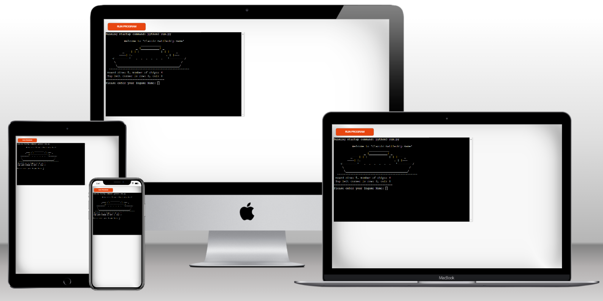
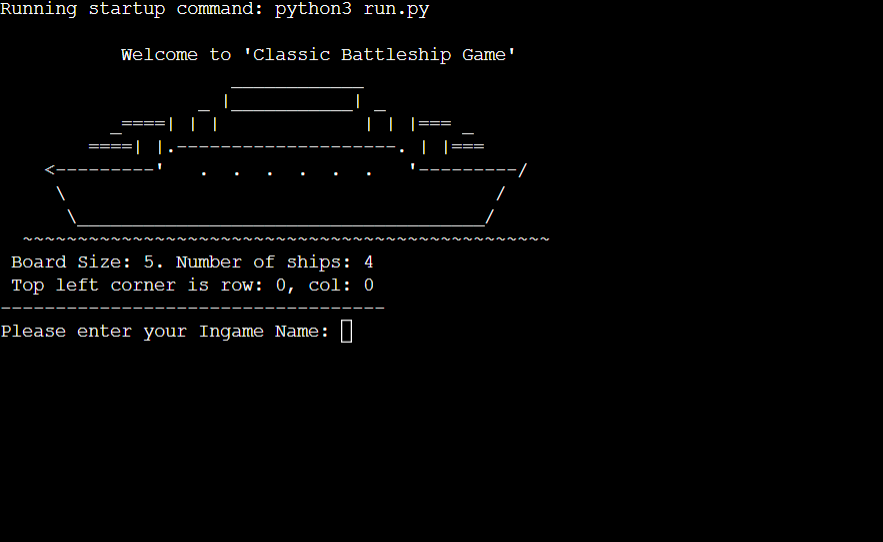
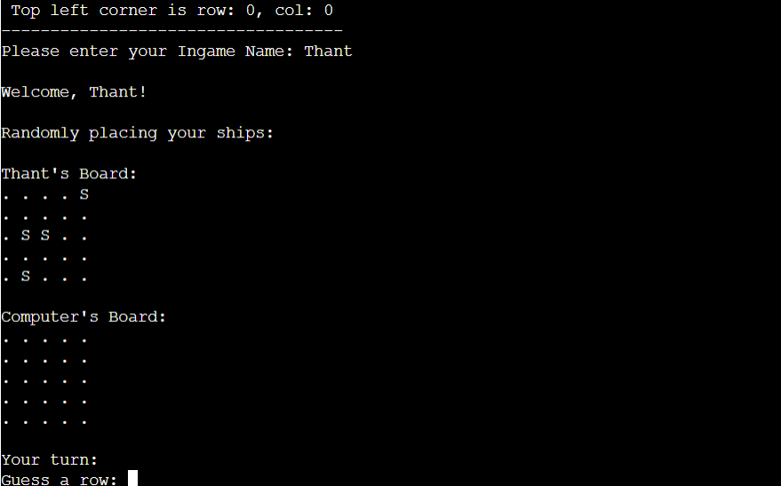
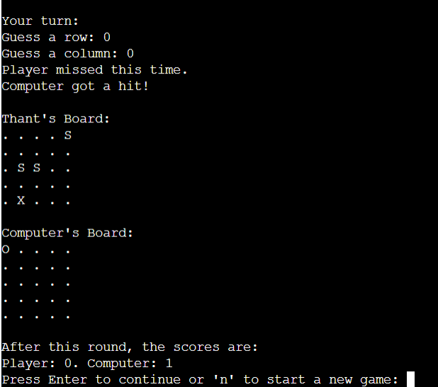

# Classic Battleship

Welcome to the Classic Battleship Game! This console-based Python game terminal game recreates the timeless strategy game we all know and love. In this game, you'll face off against a computer opponent, taking turns to strategically target and sink each other's battleships on a 5x5 grid.

You can play the game here: [Classic Battleship](https://classic-battleship-python-b7cb6f939551.herokuapp.com/)

## How to play

- Play on a 5x5 grid, take turns guessing coordinates to sink each other's ships.
- Players can enter their name and two boards are randomly generated
- Players can see where their ships are, indicated by 'S' sign and players cannot see computer's ships are.
- Guesses are marked on the board with an 'O' sign and Hits are indicated by 'X'.
- The winner is the player who sinks all of their opponent's battleships first.

## Features

### Existing Features

- **Beginning of the Game**

- Players are needed to enter their names.
- Play against the computer
- Both players' and computer's ships will be automatically generated.
- The player cannot see where the computer's ships are.

- **Maintains scores**
- **Accepts user input**
- **Press Enter to continue the game**
- **Type 'n' to play new game**

- **input validation and error-checking**

- You cannot enter coordinates outside the size of the grid
- You must enter numbers.
- You cannot enter the same guess twice
