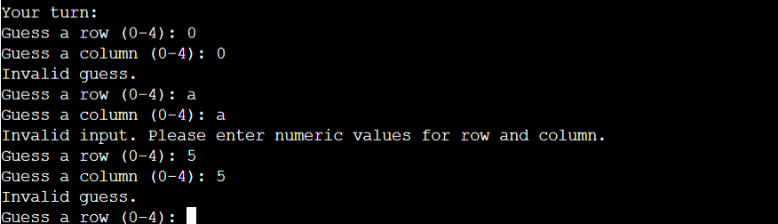

# Classic Battleship

Welcome to the Classic Battleship Game! This console-based Python game terminal game recreates the timeless strategy game we all know and love. In this game, you'll face off against a computer opponent, taking turns to strategically target and sink each other's battleships on a 5x5 grid.

You can play the game here: [Classic Battleship](https://classic-battleship-python-b7cb6f939551.herokuapp.com/)

## Authors

- [Thant Zin Oo](https://github.com/ThomasThantZin)

## How to play

- Play on a 5x5 grid, take turns guessing coordinates to sink each other's ships.
- Players can enter their name and two boards are randomly generated
- Players can see where their ships are, indicated by 'S' sign and players cannot see computer's ships are.
- Guesses are marked on the board with an 'O' sign and Hits are indicated by 'X'.
- The winner is the player who sinks all of their opponent's battleships first.

## Features

### Existing Features

- **Beginning of the Game**

- Players are needed to enter their names.
- Play against the computer
- Both players' and computer's ships will be automatically generated.
- The player cannot see where the computer's ships are.

- **Maintains scores**
- **Accepts user input**
- **Press Enter to continue the game**
- **Type 'n' to play new game**

- **input validation and error-checking**

- You cannot enter coordinates outside the size of the grid
- You must enter numbers.
- You cannot enter the same guess twice.

### Future Features

- **Multiplayer function.**
- **Allow players to position ships themselve**
- **Allow players to select board size and number of ships**
- **Playing with Larger ships**

## Data Model

### Board Class

- Represents the game board, its size, and cell characters.

### Functions

- `place_computer_ships`: Randomly places ships on the computer's board.
- `place_player_ships`: Allows the player to place their ships randomly.
- `is_valid_guess`: Checks if a player's guess is valid.
- `display_boards`: Displays the game boards.
- Player and Computer Turns: Manages player actions and guesses.

### Main Game Loop

- Stage the game flow, tracks scores, and offers the option to start new games.

### Usage

1. Create player and computer boards.
2. Use provided functions to place ships and manage turns.
3. Customize and expand the game logic as needed.

## Testing

I have manually tested this project by doing the following:

- **Passed the code through a PEP8 linter.**
- **Given invalid inputs: strings when numbers are expected, out of bounds inputs, same input twice**
- **Tested in codeanywhere terminal and Code Institute Heroku terminal**

### Bugs

- The first issue was that the code was placing only three ships instead of the required four. This occurred due to an error in specifying the minimum and maximum ship counts. However, I resolved this problem by including ship count tracking.

- Another one is, There was a problem in the code where both the player and the computer were hitting their own ships. This happened because I mixed up the instructions codes.To solve this issue, I switched the instructions so that the player now hits the computer's ships, and the computer hits the player's ships. This way, they are both aiming at the right target and won't harm their own ships.

- "I encountered difficulties while deploying my Python project to Heroku, primarily due to issues with the requirements.txt file. Initially, I attempted to generate the requirements.txt file by freezing the installed packages using pip3. However, my deployment attempts to Heroku consistently failed.

To resolve this issue, I asked a tutor named Ray for Code Institute Tutor team for help, and he provided valuable guidance and support. With Alan's help, I successfully resolved the deployment problem and got my project up and running on Heroku."

### Validator testing
- **PEP8**
- No error were returned from [PEP8 CI](https://pep8ci.herokuapp.com/).Some line adjustments caused bugs in the code and it stopped working so they were left as longer lines to avoid this issue.

## Deployment

### Heroku

The Application has been deployed from GitHub to Heroku by following the steps:

1. Create or log in to your account at heroku.com
2. Create a new app, add a unique app name ( for example classic-battleship-python) and then choose your region
3. Click on create app
4. Go to "Settings"
5. Add required buildpacks (further dependencies). For this project, set it up so Python will be on top and Node.js on bottom
6. Go to "Deploy" and select "GitHub" in "Deployment method"
7. To connect Heroku app to your Github repository code enter your repository name, click 'Search' and then 'Connect' when it shows below.
8.  Choose the branch you want to build your app from
9. If preferred, click on "Enable Automatic Deploys", which keeps the app up to date with your GitHub repository
10. Wait for the app to build. Once ready you will see the “App was successfully deployed” message and a 'View' button to take you to your deployed link.

### Branching the GitHub Repository using GitHub Desktop and Visual Studio Code
1. Go to the GitHub repository.
2. Click on the branch button in the left hand side under the repository name.
3. Give your branch a name.
4. Go to the CODE area on the right and select "Open with GitHub Desktop".
5. You will be asked if you want to clone the repository - say yes.
6. GitHub desktop will suggest what to do next - select Open code using Visual Studio Code.
   
The deployed project live link is [HERE](https://classic-battleship-python-b7cb6f939551.herokuapp.com/)

## Credits

### Code

- Took simple from Love Sandwiches.
- Took simple design from [CI PP3 Scope](https://www.youtube.com/watch?time_continue=283&v=4sqtzZQpDJE&embeds_referring_euri=https%3A%2F%2Flearn.codeinstitute.net%2F&embeds_referring_origin=https%3A%2F%2Flearn.codeinstitute.net&source_ve_path=NzY3NTg&feature=emb_yt_watermark)
- Took readme.md template simple from Code Institute PP3 'ULTMATE BATTLESHIP'
- And i also would like to give credit to my friend Rapheal for taught me how to fix the error codes.

## Acknowledgements

I would like to take the opportunity to thank:

- To God, who is with me the whole time when I writing the code for this python game.
- The lovely and helpful people on the Code Institute Slack page for support.
- Code Institute Tutor team who helped me with some of the errors I encountered while deploying my project.
- My lovely friends from Myanmar, who are helping me.
- To Code Institute Community for teaching me how to write these CODES.

